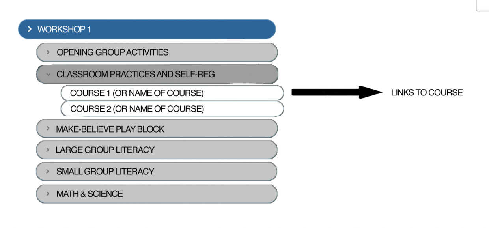
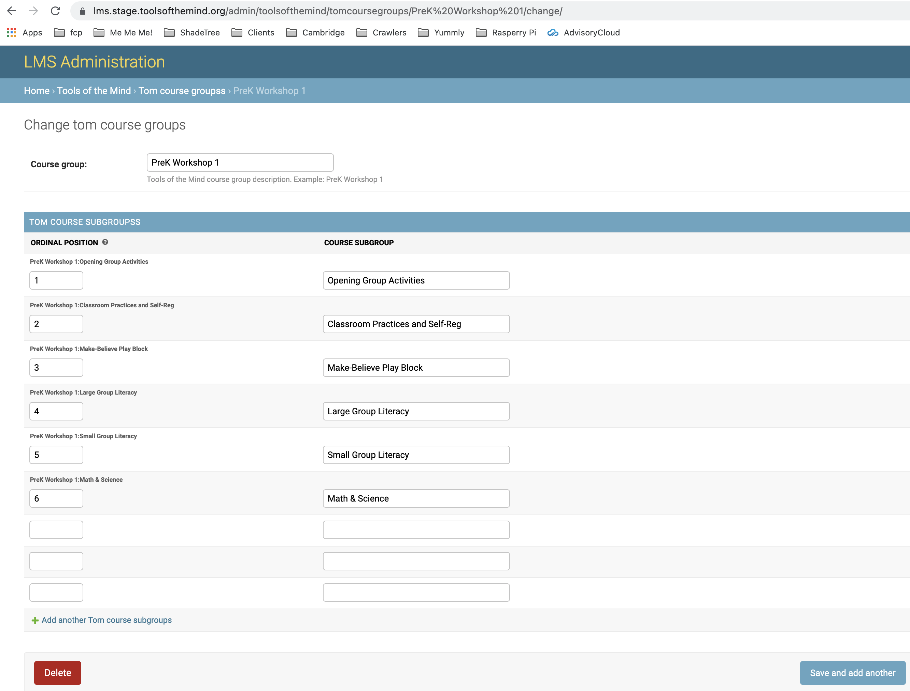

# edx-toolsofthemind Django Plugin

[](https://lawrencemcdaniel.com)


An Open edX plugin that implements custom data models for categorization of the course library for the learner Home and Discovery pages.



This sample data would be implemented using Django Admin as per the following example:




## Installation on native build


```bash
sudo -H -u edxapp bash
source /edx/app/edxapp/edxapp_env
source /edx/app/edxapp/venvs/edxapp/bin/activate
pip install git+https://github.com/Tools-of-the-Mind/edx-toolsofthemind.git
```

## Developer Notes

```bash
# to run tests
sudo -H -u edxapp bash
source /edx/app/edxapp/edxapp_env
source /edx/app/edxapp/venvs/edxapp/bin/activate
pip install -r requirements/edx/testing.txt
cd ~/edx-platform
./manage.py lms test toolsofthemind --settings=test
```
